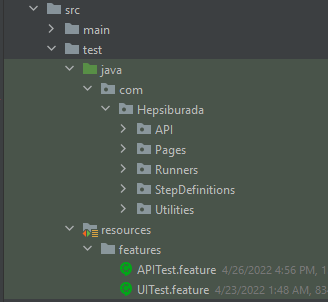

# PROJE ÖZETİ
* Bu porje Hepsiburada için geliştirildi
* Yazılım geliştirme dili olarak **[Java 11](https://openjdk.java.net/projects/jdk/11/)** kullanıldı
* Build management tool olarak **[Maven 3.8.4](https://maven.apache.org/docs/3.8.4/release-notes.html)** kullanıldı
* Framework olarak **[Cucumber BDD](https://cucumber.io/)** kullanıldı
* Proje ayrıca OS sisteminide destekliyor
* Proje birden fazla browserı destekliyor ayrıca Selenium Grid ve paralel testi de destekliyor
* Rapolama için "maven-cucumber-reporting plugin" versiyon "5.0.0" kullanılıyor
* Proje **[Intellij IDEA](https://www.jetbrains.com/idea/)** kullanılarak oluşturuldu
* Task hakkında detayları **[Hepsiburada - Case Study](https://drive.google.com/file/d/17ERg6o-aZA41r1KprBQehD036MWrzqoT/view?usp=sharing)** bağlantısında bulabilirsiniz

# PROJE YAPISININ ÖZETİ
* Proje Cucumber BDD üzerinde 4 ana paket içerisinde geliştirildi

    * src dosyası ==> test kodlarını ve özellik dosyalarını içerir (kod yapısının ana gövdesi)
        * src dosya yapısı aşağıdaki gibidir
        
         
    
        * java dosyası ana kod yapısını içerir ve resource dosyası feature/scenario dosyalarını içerir
          * POM dizayn yapısı JAVA dosyası içerisinde kullanıldı
          * pages paketi ==> Page Object Model her farklı sayfanın ilgili sayfasını tanımlar
          * runners paketi ==> projeyi yürütmek için runner class içerir 
          * step definition ==> ilgili yürütmeye ait kodları içerir
          * utilities ==> utility classları projeyi yürütmede desteklemek için içerir
        * resource dosyası ==> Gherkin dilinde yazılmış senaryoları feature/execution dosyasında içerir 
    * configuration.properties ==> Testle alakalı dataları içerir(örn. username,password,URL)
    * pom.xml ==> projenin ihtiyacı olan dependencies, options, plugins yapılarını içerir

# TEST UYGULAMASI

* JAVA, maven, **[Google Chrome (latest version)](https://www.google.com/chrome/?brand=CHBD&gclid=Cj0KCQjwr-SSBhC9ARIsANhzu15P0PA-n9Zp4NpxKaOHVGtBD1TZQH0HlQQE6hUfsOFAU1nf-Rzdlf4aAoTJEALw_wcB&gclsrc=aw.ds)** toollarına sahip olmamız gerekir
* Projeyi locale clone et
* Eğer testi IDE üzerinde yürütmek istiyorsan cukesrunner classı kullanman gerekiyor ve cukesrunner class konumuna gidip sadece run butonuna tıklamalısın.

### Developed by Gokberk Kaan Uzun
#### contact@kaanuzun.com